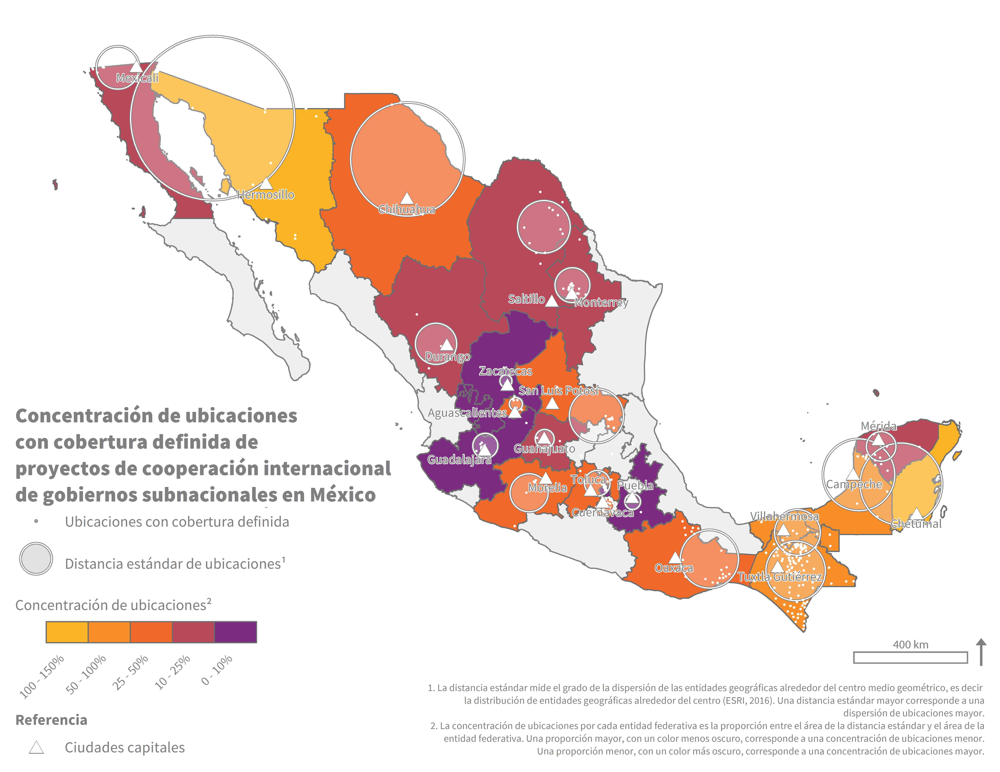

# Standard distance and concentration of discrete locations of international development projects by subnational actors in Mexico
Presented is an ArcPy script to generate standard distances for project locations by federal entity and calculate the concentration of these locations standardized by the federal entity area. Used in the [Mapping of international cooperation projects and actions by subnational governments in Mexico](https://www.undp.org/es/mexico/publicaciones/mapeo-de-proyectos-y-acciones-de-cooperacion-internacional-de-gobiernos-subnacionales-en-mexico) (Mapeo de Proyectos y Acciones de Cooperación Internacional de Gobiernos subnacionales en México) published by UNDP and AMEXCID.

## Translation of map
### Title
> Concentration of discrete locations of international cooperation projects by subnational governments in Mexico
### Legend and References
> * Locations with defined coverage
> * Standard distance of locations
> * Concentration of locations
> * Capital cities
### Notes
> 1. The standard distance measures the degree of dispersion of geographic entities around the geometric mean center, that is, the distribution of geographic entities around the center (ESRI, 2016). A larger standard distance corresponds to a greater dispersion of locations.
> 2. The concentration of locations for each state is the proportion between the area of the standard distance and the area of the state. A higher proportion, represented by a lighter color, corresponds to a lower concentration of locations. A lower proportion, represented by a darker color, corresponds to a higher concentration of locations.
